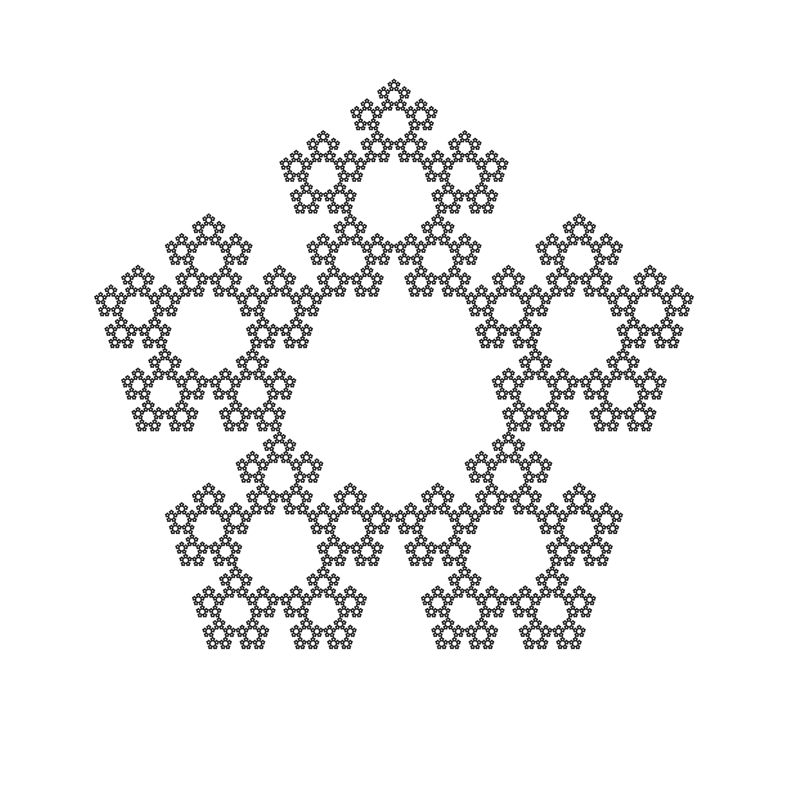

## TODO

- **Export**
  - Put the recursive fractal calculation on a background thread?
    - There is no point in interacting with the UI while the thing is generating, it's just nice
    - Adjust the *expected steps* hint calculation - take into account that with rules, some vertices are omitted, making the calculation potentially much faster!

- Configuration
  - Have a separate `float` field with a slider, if the **range** is small enough (like from 0 to 5 or something)

- Snap points to a grid. Maybe just a square grid at first. Show guidance lines.
- Edit currently placed points
  - Remove (Right click
  - Detect input events directly in the mouse  detector. Input actions are not suitable for this I think.
  - Not sure if I can re-render for every change (smooth). Maybe with a small number of iterations? Just for a preview

## Resources

- https://en.wikipedia.org/wiki/Chaos_game
