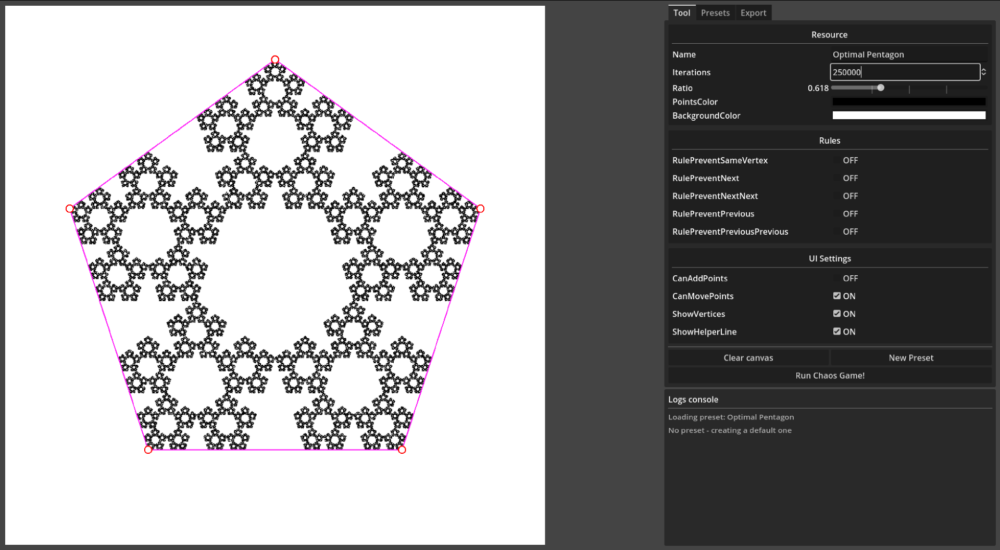

# Chaos Game - Fractal generator

A tool for playing around with [Chaos Game](https://en.wikipedia.org/wiki/Chaos_game) and possibly generating some cool fractals!

## Features

- Configure the chaos game by tweaking its vertices, ratio and vertex selection rules.
- Add vertices with left click, drag them around to see how the fractal changes, remove them with right click
- There is a bunch of pre-made presets with interesting fractals. Play around with them and see if you can come up with something cool.
- Export your fractal into a PNG. Images are saved into `exports/image.png` folder relative to where you ran the executable.

## Exporting

What you are usually seeing on the screen is an *iterative approximation* of the fractal defined by your configuration. The simulation runs for arbitrary number of steps (usually few hundred thousand). This method is really fast (chaos game is redrawn every time you change anything), but has a lot of missing pixels everywhere.

For export a **recursive algorithm** is used that doesn't just leave out empty pixels everywhere. It generates the fractal *perfectly*, but this comes at a significant performance cost. Exporting a 8-vertex chaos game with 10 levels of recursion might take around a minute. So sit back and relax!

The tool provides an *estimate* of how many operations will be needed for the export image. Use this to get an idea of how long will the export take. Tens of thousands operations are practically instant, hundreds of thousands take a tiny while, millions take potentially a long time.

## TODO

- **Export**
  - Put the recursive fractal calculation on a background thread?
    - There is no point in interacting with the UI while the thing is generating, it's just nice
- Snap points to a grid. Maybe just a square grid at first. Show guidance lines.

## Resources

- https://en.wikipedia.org/wiki/Chaos_game
