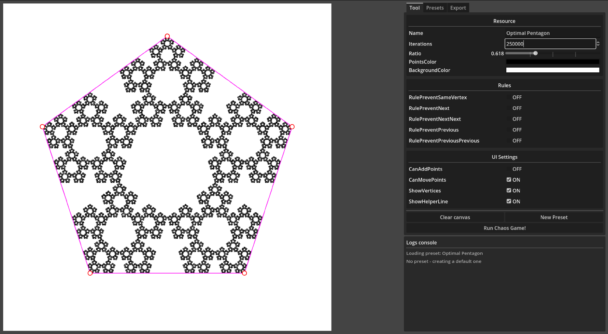

# Chaos Game - Fractal generator

A tool for playing around with [Chaos Game](https://en.wikipedia.org/wiki/Chaos_game) and possibly generating some cool fractals!

## Features

- Configure the chaos game by tweaking its vertices, ratio and vertex selection rules.
  - Add vertices with left click, drag them around to see how the fractal changes, remove them with right click

- There is a bunch of pre-made presets with interesting fractals. Play around with them and see if you can come up with something cool.
  - You can create your own presets for later use!

- Export your fractal into a PNG. Images are saved into `exports/<preset-name>.png` folder relative to where you ran the executable.

## Exporting

What you are usually seeing on the screen is an *iterative approximation* of the fractal defined by your configuration. The simulation runs for arbitrary number of steps (usually few hundred thousand). This method is really fast (chaos game is redrawn every time you change anything), but has a lot of missing pixels everywhere.

For export a **recursive algorithm** is used that doesn't just leave out empty pixels everywhere. It generates the fractal *perfectly*, but this comes at a significant performance cost. 

> Exporting a 8-vertex chaos game with 10 levels of recursion might take a minute. So sit back and relax!

The tool provides an *estimate* of how many operations will be needed for the export image. Use this to get an idea of how long will the export take. Tens of thousands operations are practically instant, hundreds of thousands take a tiny while, millions take potentially a long time. If the fractal looks good with a million iterative steps, it will also probably look good with million steps done with recursion.

## TODO

- Snap points to a grid - just a square grid at first? Show guidance lines maybe?
- Finer control over the points. Maybe click on a point to make it _selected_ and then you could adjust it's precise location with a couple of fields?
- When saving an existing preset, warn about _overwriting_ it.
- When exporting to an image that already exists, append a number to it or something. Let people make stuff.
- Allow transparency for point colors and actually _add_ the pixel colors together. How will this interact with the background color?
- Add update reminder somehow (just check GitHub I guess?)
- Human readable _expected iterations_ in export tabs.

## Resources

- https://en.wikipedia.org/wiki/Chaos_game
